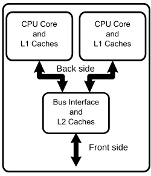
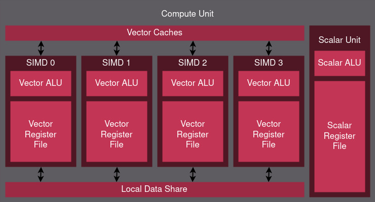
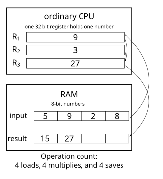
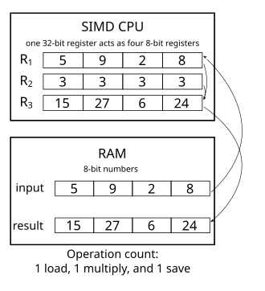
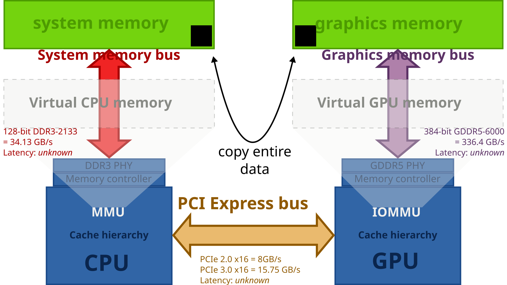

# Jak działa karta graficzna

Współczesne karty graficzne służą już nie tylko do renderowania grafiki ale też do wykonywania skomplikowanych obliczeń. Różnią się od procesora swoją architekturą, w niektórych zadaniach są wolniejsze a w innych znacznie szybsze.

## Różnica między procesorem a kartą graficzną

Procesor komputera posiada kilka rdzeni, zazwyczaj konsumenckie procesory (na stan 2025) zawierają od 4 do 24 rdzeni. Rdzenie te są bardzo wydajne, posiadają wiele skomplikowanych instrukcji, oraz mogą wykonywać różne instrukcje w tym samym czasie na różnych zesetawach danych. Oznacza to że są układami MIMD (Multiple Instruction Multiple Data)

> **przykładowa konfiguracja rdzeni, pamięci cache oraz szyn w procesorze** \
> źródło - [wikipedia](https://en.wikipedia.org/wiki/Multi-core_processor) \
> *użycie w celach edukacyjnych*

Karta graficzna natomiast jest układem SIMD (Same Instruction Multiple Data). Oznacza to że rdzenie są pogrupowane, i muszą wykonywać te same operacje (Same Instruction) ale mogą je wykonywać na różnych danych (Multiple Data).

Współczesne karty graficzne posiadają setki, a nawet tysiące rdzeni zorganizowanych w strukturę trzystopniową. Rdzenie są podzielone w grupy zwane CU - Compute Unit (w przypadku grafik AMD) lub SM - Streaming MultiProcesor (w przypadku grafik Nvidii)

> **przykładowa konfiguracja pojedyńczego CU** \
> źródło - [ROCm](https://rocm.docs.amd.com/projects/HIP/en/latest/understand/hardware_implementation.html) \
> *użycie w celach edukacyjnych*

## SIMD - co to oznacza dla programisty

Dla programisty oznacza to że jeśli mamy wektor danych, dla którego na każdym elemencie wykonujemy tą samą operację możemy ją wykonać kosztem mniejszej ilości instrukcji.

> **zobrazowanie różnicy w procesorach sekwencyjnych i simd** \
> źródło - [wikipedia](https://en.wikipedia.org/wiki/Single_instruction,_multiple_data) \
> *użycie w celach edukacyjnych*

Niestety aby tego dokonać bezpiecznie pamięć która jest modyfikowana musi być rozłącznie rozdzielona pomiędzy jednostki, ponieważ każdy z rdzeni w jednej grupie nie może nadpisywać danych modyfikowanych lub czytanych przez pozostałe rdzenie. Przestrzeganie zasady aby rdzenie operowały na innych obszarach pamięci jest ważne ponieważ jeśli kilka rdzeni zrobi zapis do jednego obszaru pamięci to dane w tym obszarze będą losowe (tj. zostaną zapisane dane z ostatniego zapisującego rdzenia).

## Pamięc w karcie graficznejs

Karty graficzne korzystają z oddzielnej pamięci. Nie znaczy to że nie możemy jej modyfikować, wręcz przeciwnie, host (tj. procesor) ma dostęp do pamięci karty graficznej poprzez BAR (base address register) lub poprzez wysyłanie odpowiednich komend to karty. Nie jest to dostęp bezpośredni, co oznacza że nie możemy zapisać danych od razu na konkretny adres, musimy je najpierw zapisać w pamięci hosta a następnie kopiować do pamięci karty. 

Zazwyczaj sekwencja według której wykonuje się komunikację z kartą wygląda w następujący sposób:
1. Tworzenie buforów po stronie hosta - najlepiej jest tworzyć od razu wszystkie bufory (tj. te które będziemy wysyłać i te którymi będziemi odbierać dane) ponieawż wtedy kompilator zoptymalizuje alokacje.
2. Tworzenie buforów po stronie GPU - jest to najdłużej trwający proces, odbywający się sekwencyjne (tj. procesor czeka aż GPU da informację zwrotną o poprawnej alokacji danego obszaru). Jeżeli jesteśmy w środowisku w którym renderujemy obraz najlepiej jest alokować je raz i potem używać ich ponownie w każdej klatce.
3. Zapełnienie buforów hosta - w tym momencie wpisujemy dane do buforów hosta jak i zerujemy bufory wyjściowe (zerowanie jest opcjonalne ale preferowane).
4. Kopiowanie buforów do GPU - kopiowanie danych również jest operacją sekwencyjną przez co powinno być wykonywane jak najrzadziej. 
5. Kopiowanie buforów zwrotnych - ten etap jest wykonywany po egzekucji programu lub po skończonym etapie renderowania.

> źródło - [wikipedia](https://en.wikipedia.org/wiki/Graphics_card) \
> *użycie w celach edukacyjnych*

